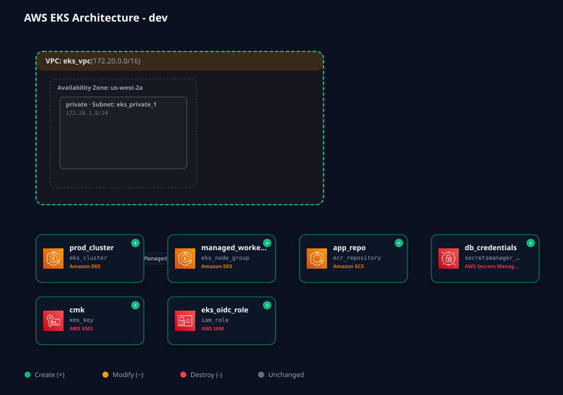

# EKS Terraform Infrastructure

# 🚀 AWS EKS Infrastructure as Code with Terraform

[](https://www.terraform.io/)
[](https://registry.terraform.io/providers/hashicorp/aws/latest)
[](https://kubernetes.io/)
[](https://github.com/mchittineni/tf-arch-diagram-generator)
[](https://github.com/features/actions)
[](https://github.com/terraform-linters/tflint)

## 📖 About The Project

Complete Infrastructure as Code (IaC) solution for deploying a production-ready Amazon EKS (Elastic Kubernetes Service) cluster with Terraform. This project demonstrates DevOps best practices for managing AWS Kubernetes infrastructure including networking, compute, database, and monitoring in a unified, modular manner.

### ✨ Key Features

- ☁️ **AWS-Native EKS**: Amazon EKS managed Kubernetes service (v1.36+) with auto-managed control plane
- 🐧 **Amazon Linux 2023**: Modern managed node group using `AL2023_x86_64_STANDARD` with automated rolling updates
- 🔒 **Production-Ready Security**: Multi-AZ deployment, private networking, encryption at rest and in transit
- 📊 **Integrated Monitoring**: Prometheus workspace and Grafana for metrics, dashboards, and alerting
- 🏗️ **Modular Architecture**: Reusable, independently deployable modules (networking, compute, database, monitoring)
- 📈 **Auto-Scaling**: Configurable node groups (2-10 nodes) with automatic scaling
- 🗄️ **Managed Database**: Amazon RDS PostgreSQL 16 Multi-AZ instance with SSL enforcement and automated backups
- 🗺️ **Automated Architecture Diagrams**: Real-time cloud diagram generation powered by [tf-arch-diagram-generator](https://github.com/mchittineni/tf-arch-diagram-generator)
- 🧪 **Continuous Compliance**: Checkov, tfsec, and TFLint in GitHub Actions CI/CD workflows
- 🚀 **Quick Deployment**: 15-25 minute deployment with included helper scripts

---

## 🗺️ Visual Cloud Architecture Diagram

Continuous cloud architecture visualization generated directly from the Terraform plan by **[tf-arch-diagram-generator](https://github.com/mchittineni/tf-arch-diagram-generator)**:



> 💡 **Interactive Architecture Viewer**:
> Explore your live or planned architecture in an interactive web canvas (with resource inspector and containment hierarchy):
> ```bash
> ./scripts/generate_diagram.sh --serve
> ```

---

## 📁 Complete Project Structure

```
EKS-Terraform-Infrastructure-Setup/
│
├── ⚙️ .github/workflows/                 # Production CI/CD Workflows
│   ├── validate.yml                     # Syntax, formatting, tflint & Checkov security scan
│   ├── plan.yml                         # Terraform plan + tf-arch architecture diagram generator
│   ├── apply.yml                        # Automated apply with post-deploy diagram refresh
│   ├── destroy.yml                      # Protected manual environment teardown
│   └── diagram.yml                      # Dedicated on-demand diagram generator
│
├── 📄 Root Configuration Files
│   ├── main.tf                          # Primary Terraform configuration and provider setup (>= 1.16.1, AWS ~> 6.62.0)
│   ├── variables.tf                     # All input variables with validation rules
│   ├── outputs.tf                       # Output values for infrastructure endpoints
│   └── terraform.tfvars.example         # Example configuration template
│
├── 📁 modules/                          # Reusable Terraform modules
│   │
│   ├── aws/                             # AWS provider modules
│   │   ├── compute/
│   │   │   ├── main.tf                  # EKS cluster, launch templates, AL2023 node groups
│   │   │   ├── variables.tf             # Compute module input variables (K8s 1.36+)
│   │   │   └── outputs.tf               # Cluster endpoints, names, configurations
│   │   │
│   │   ├── networking/
│   │   │   ├── main.tf                  # VPC, subnets, security groups, NAT gateways
│   │   │   ├── variables.tf             # Network configuration variables
│   │   │   └── outputs.tf               # VPC IDs, subnet IDs, endpoint references
│   │   │
│   │   ├── database/
│   │   │   ├── main.tf                  # RDS PostgreSQL 16, S3 backup buckets, SSL params
│   │   │   ├── variables.tf             # Database configuration and credentials
│   │   │   └── outputs.tf               # RDS endpoints, bucket names, connection strings
│   │   │
│   │   └── monitoring/
│   │       ├── main.tf                  # CloudWatch, alarms, log groups, SNS alerts
│   │       ├── variables.tf             # Monitoring thresholds and configurations
│   │       └── outputs.tf               # Log group names, alarm endpoints
│   │
│   └── monitoring/                      # Cross-cloud monitoring stack
│       └── centralized/
│           ├── main.tf                  # Prometheus workspace, Grafana workspace deployment
│           ├── variables.tf             # Monitoring stack configuration
│           └── outputs.tf               # Dashboard URLs, Prometheus endpoints
│
├── 📁 docs/                             # Comprehensive documentation
│   ├── architecture.md                  # System design, component relationships
│   ├── architecture.svg                 # Rendered visual architecture diagram
│   ├── ci-cd-pipeline.md                # Step-by-step pipeline instructions
│   ├── deployment-guide.md              # Step-by-step deployment instructions
│   ├── security.md                      # Security best practices, compliance info
│   └── troubleshooting.md               # Common issues and solutions
│
├── 📁 scripts/                          # Helper shell scripts
│   ├── init.sh                          # Initialize Terraform, create workspaces
│   ├── deploy.sh                        # Plan and apply Terraform changes
│   ├── destroy.sh                       # Safely destroy infrastructure
│   ├── generate_diagram.sh              # Generate architecture diagram via tf-arch
│   └── ensure_backend_bucket.sh         # Create/configure S3 state backend
│
├── 🔧 Quality & Compliance Configuration
│   ├── .tflint.hcl                      # TFLint configuration for code quality
│   ├── .checkov.yml                     # Checkov security policy checks
│   ├── .tfsec.yml                       # tfsec security scanning rules
│   └── .gitignore                       # Git ignore patterns
│
└── 📄 README.md                         # Project documentation (this file)
```

---

## 🏗️ Architecture Overview

```
┌─────────────────────────────────────────────────────────────┐
│                   AWS MULTI-AZ DEPLOYMENT                   │
├─────────────────────────────────────────────────────────────┤
│                                                             │
│  ┌──────────────────────────────────────────────────────┐   │
│  │  VPC (CIDR: 10.0.0.0/16)                             │   │
│  │  ├─ Public Subnets (AZ-1, AZ-2, AZ-3)                │   │
│  │  │  └─ NAT Gateways + Internet Gateway               │   │
│  │  ├─ Private Subnets (AZ-1, AZ-2, AZ-3)               │   │
│  │  │  └─ EKS Nodes, RDS, Monitoring                    │   │
│  │  └─ Security Groups & NACLs                          │   │
│  └──────────────────────────────────────────────────────┘   │
│                                                             │
│  ┌──────────────────────────────────────────────────────┐   │
│  │  EKS Cluster (Kubernetes Control Plane v1.36+)       │   │
│  │  ├─ Managed Node Groups (AL2023, Auto Scaling)       │   │
│  │  ├─ Prometheus + Grafana (Monitoring)                │   │
│  │  ├─ CoreDNS, kube-proxy, VPC CNI                     │   │
│  │  └─ RBAC & Network Policies                          │   │
│  └──────────────────────────────────────────────────────┘   │
│                                                             │
│  ┌──────────────────────────────────────────────────────┐   │
│  │  Data Layer                                          │   │
│  │  ├─ RDS PostgreSQL 16 Multi-AZ                       │   │
│  │  ├─ S3 Buckets (Versioning, Encryption)              │   │
│  │  ├─ AWS Secrets Manager                              │   │
│  │  └─ DynamoDB (Optional)                              │   │
│  └──────────────────────────────────────────────────────┘   │
│                                                             │
│  ┌──────────────────────────────────────────────────────┐   │
│  │  Observability & Logging                             │   │
│  │  ├─ CloudWatch Logs & Alarms                         │   │
│  │  ├─ Prometheus Metrics Workspace                     │   │
│  │  ├─ Grafana Workspaces & Dashboards                  │   │
│  │  └─ Amazon SNS Alerting                              │   │
│  └──────────────────────────────────────────────────────┘   │
│                                                             │
└─────────────────────────────────────────────────────────────┘
```

---

## 🔧 Configuration Files Explained

### **main.tf** - Root Configuration
- Terraform version and provider requirements (AWS ~> 6.0)
- S3 backend for state management with encryption and locking
- Provider configuration with default tags
- AWS Secrets Manager setup for storing Terraform metadata

### **variables.tf** - Input Variables
| Variable                 | Type   | Purpose                                  | Default     |
| ------------------------ | ------ | ---------------------------------------- | ----------- |
| `project_name`           | string | Project identifier for tagging           | "AWS-Infra" |
| `environment`            | string | dev, staging, or production              | -           |
| `owner_email`            | string | Infrastructure owner contact (validated) | -           |
| `alert_email`            | string | Alert notification recipient (validated) | -           |
| `aws_region`             | string | AWS region for deployment                | "us-east-1" |
| `aws_node_count`         | number | EKS worker nodes (2-10)                  | 6           |
| `aws_instance_type`      | string | EC2 instance type for nodes              | "t3.medium" |
| `enable_monitoring`      | bool   | Enable Prometheus/Grafana stack          | true        |
| `enable_aws`             | bool   | Enable AWS infrastructure                | true        |
| `grafana_admin_password` | string | Grafana password (12+ chars, complex)    | -           |
| `aws_db_multi_az`        | bool   | Multi-AZ RDS deployment                  | true        |

### **outputs.tf** - Infrastructure Outputs
Exposes critical infrastructure endpoints:
- AWS VPC ID and networking configuration
- EKS cluster endpoint and credentials
- RDS database connection strings (sensitive)
- CloudWatch log groups and monitoring URLs
- Grafana, Prometheus, and Kibana dashboards

---

## 🚀 Quick Start Guide

### Prerequisites

```bash
# Required tools
- Terraform >= 1.16.1
- Node.js >= 24 (required for tf-arch-diagram-generator)
- AWS CLI v2 (configured with credentials)
- kubectl (for Kubernetes cluster interactions)
- Git

# AWS Permissions Required
- S3 (create/manage buckets for state and backups)
- EC2 (create VPC, subnets, security groups, route tables)
- EKS (create/manage clusters and managed node groups)
- RDS (create database instances, parameter groups, subnet groups)
- CloudWatch & SNS (logs, metrics, dashboards, and alerting)
- IAM (roles and policies for cluster, nodes, and monitoring)
- Secrets Manager (store database and admin credentials)
```

### Installation & Setup

```bash
# 1. Clone the repository
git clone https://github.com/mchittineni/eks-terraform.git
cd eks-terraform

# 2. Create terraform.tfvars from example
cp terraform.tfvars.example terraform.tfvars

# 3. Edit terraform.tfvars with your configuration
nano terraform.tfvars
# Required configurations:
# - environment: dev, staging, or production
# - owner_email: your@email.com (must be valid)
# - alert_email: alerts@email.com (must be valid)
# - aws_region: AWS region (us-east-1, eu-west-1, etc.)
# - aws_node_count: 2-10 (recommended: 6)
# - grafana_admin_password: 12+ chars, uppercase, lowercase, number, special char

# 4. Configure AWS Credentials into your local terminal
export AWS_ACCESS_KEY_ID="xxxxxxx"
export AWS_SECRET_ACCESS_KEY="xxxxxxx"
export AWS_SESSION_TOKEN="xxxxxxx"

# 5. Ensure backend S3 bucket exists
export AWS_REGION=us-east-1
./scripts/ensure_backend_bucket.sh

# 6. Initialize Terraform
./scripts/init.sh

# 7. Plan deployment
terraform plan -out=tfplan

# 8. Generate Visual Cloud Architecture Diagram
./scripts/generate_diagram.sh dev --serve

# 9. Apply configuration
terraform apply tfplan
```

### Environment-Specific Deployment

Using Terraform workspaces to isolate state per environment:

```bash
# Deploy to dev environment
./scripts/deploy.sh dev

# Deploy to staging
./scripts/deploy.sh staging

# Deploy to production
./scripts/deploy.sh production

# Destroy an environment
./scripts/destroy.sh dev
```

### Module-Specific Operations

```bash
# Plan only AWS networking module
terraform plan -target=module.aws_networking

# Apply only compute (EKS) changes
terraform apply -target=module.aws_compute

# Destroy only monitoring stack
terraform destroy -target=module.aws_monitoring
```

---

## 📊 Module Documentation

### **aws/networking**
Provisions AWS VPC infrastructure:
- VPC with configurable CIDR block
- Public/Private subnets across multiple AZs
- Internet Gateway and NAT Gateways
- Route tables and associations
- Security groups with ingress/egress rules

**Key Outputs:**
- `vpc_id`: VPC identifier
- `private_subnet_ids`: List of private subnets for EKS nodes
- `public_subnet_ids`: List of public subnets for load balancers

### **aws/compute**
Deploys Kubernetes infrastructure:
- EKS cluster (managed control plane)
- Managed node groups with auto-scaling
- IAM roles for cluster and nodes
- Security group configurations
- OIDC provider for IRSA (IAM Roles for Service Accounts)

**Key Outputs:**
- `cluster_endpoint`: EKS API endpoint
- `cluster_name`: Cluster identifier
- `cluster_ca_certificate`: Certificate authority

### **aws/database**
Manages data storage:
- RDS instance (PostgreSQL/MySQL) with Multi-AZ
- Automated backups and encryption
- S3 buckets with versioning and encryption
- Parameter groups and option groups
- Database subnet groups

**Key Outputs:**
- `db_endpoint`: RDS connection endpoint
- `db_name`: Database name
- `s3_bucket_name`: S3 bucket for application data

### **aws/monitoring**
CloudWatch and alerting:
- Log groups for application and system logs
- CloudWatch alarms for CPU, memory, disk
- SNS topics for notifications
- Dashboard configuration

**Key Outputs:**
- `log_group_name`: CloudWatch log group
- `sns_topic_arn`: SNS topic for alerts

### **monitoring/centralized**
Centralized monitoring stack:
- Prometheus server for metrics collection
- Grafana for visualization and dashboards
- ELK stack (Elasticsearch, Logstash, Kibana)
- Pre-configured dashboards and alerts

**Key Outputs:**
- `grafana_url`: Grafana web interface
- `prometheus_url`: Prometheus UI
- `kibana_url`: Kibana for log analysis

---

## 🔍 Quality & Security Scanning

### **TFLint** (.tflint.hcl)
Terraform code quality linter:
```bash
tflint --config=.tflint.hcl .
```
Checks:
- Syntax and formatting issues
- AWS best practices (e.g., deprecated resources)
- Security configuration errors
- Unused variables and declarations

### **Checkov** (.checkov.yml)
Infrastructure security scanning:
```bash
checkov -o cli -c .checkov.yml --framework terraform .
```
Validates:
- 80+ AWS security policies (CKV1_AWS_*)
- Encryption at rest and in transit
- IAM least privilege
- Logging and monitoring enablement
- Compliance frameworks (CIS, PCI-DSS, HIPAA)

### **tfsec** (.tfsec.yml)
Terraform security scanning:
```bash
tfsec --config-file .tfsec.yml .
```
Detects:
- 64+ AWS security rules (aws001-aws064)
- Unencrypted resources
- Publicly accessible services
- Weak security group rules
- Missing backup and logging

### Running Quality Checks

```bash
# Format check
terraform fmt -check -recursive

# Validate syntax
terraform validate

# Full quality check (all tools)
make check  # or run individually:
tflint --config=.tflint.hcl .
checkov -o cli -c .checkov.yml --framework terraform .
tfsec --config-file .tfsec.yml .
```

---

## 📁 Script Reference

### **init.sh**
Initializes Terraform environment:
```bash
./scripts/init.sh

# Actions:
# - Ensures Secrets Manager secret and backend bucket exist
# - Initializes Terraform backend
# - Creates dev, staging, production workspaces
# - Sets default workspace to current environment
```

### **deploy.sh**
Plans and applies infrastructure changes:
```bash
./scripts/deploy.sh [environment]

# Example:
./scripts/deploy.sh production

# Actions:
# - Switches to specified workspace
# - Runs terraform plan
# - Applies changes
```

### **destroy.sh**
Safely destroys infrastructure:
```bash
./scripts/destroy.sh [environment]

# Example:
./scripts/destroy.sh dev

# Actions:
# - Switches to specified workspace
# - Prompts for explicit confirmation
# - Destroys resources in environment
```

### **generate_diagram.sh**
Generates and serves visual cloud architecture diagrams using [tf-arch-diagram-generator](https://github.com/mchittineni/tf-arch-diagram-generator):
```bash
# Generate architecture.svg from active workspace
./scripts/generate_diagram.sh dev

# Generate diagram and launch interactive canvas in your default browser
./scripts/generate_diagram.sh dev --serve

# Render diagram from an existing JSON plan file
./scripts/generate_diagram.sh --plan plan.json -o docs/architecture.svg
```

### **ensure_backend_bucket.sh**
Manages S3 state backend:
```bash
export AWS_REGION=us-east-1
./scripts/ensure_backend_bucket.sh

# Actions:
# - Creates S3 bucket if not exists
# - Enables versioning
# - Enables server-side encryption
# - Configures bucket policies
```

---

## 🗺️ Architecture Diagram Plan Generator

This project integrates **[tf-arch-diagram-generator](https://github.com/mchittineni/tf-arch-diagram-generator)** directly into the developer workflow and CI/CD pipelines.

### Capabilities
- **Exact Cloud Topology**: Generates containment hierarchy (VPC → Availability Zones → Public/Private Subnets → EKS Nodes, RDS, Gateways) from the Terraform plan JSON (`terraform show -json`).
- **Zero Browser Dependencies**: Runs headlessly in CI to produce clean, crisp vector SVGs (`docs/architecture.svg`).
- **Interactive Local Viewer**: `tf-arch serve plan.json --open` opens a web canvas with directional traffic spotlighting, resource inspection drawers, and connection links.
- **Plan-Aware Indicators**: Badges nodes with `+ create`, `~ update`, and `- destroy` states.

### Installation Options for Diagram Generator
```bash
# Option 1: macOS via Homebrew (Recommended)
brew install mchittineni/tap/tf-arch

# Option 2: npm global or npx
npm install -g tf-arch-diagram-generator
# or run directly with npx:
npx -y tf-arch-diagram-generator --help

# Option 3: Python (pip / uv)
pip install tf-arch-diagram-generator
```

---

## 🔄 GitHub Actions CI/CD Workflows

The repository includes 5 production-grade workflows located in `.github/workflows/`:

| Workflow                | File                                             | Trigger                      | Purpose                                                                                                             |
| :---------------------- | :----------------------------------------------- | :--------------------------- | :------------------------------------------------------------------------------------------------------------------ |
| **Validate & Security** | [`validate.yml`](.github/workflows/validate.yml) | Push to `main`, PRs          | `terraform fmt`, `terraform validate`, `tflint` (AWS ruleset 0.38+), Checkov security scan                          |
| **Plan & Diagram**      | [`plan.yml`](.github/workflows/plan.yml)         | Pull Requests, Dispatch      | OIDC login, `terraform plan`, renders `docs/architecture.svg` via `tf-arch-diagram-generator`, and posts PR comment |
| **Apply**               | [`apply.yml`](.github/workflows/apply.yml)       | Push to `main`, Dispatch     | Deploys infrastructure, re-renders architecture diagram from state, captures outputs                                |
| **Diagram Generator**   | [`diagram.yml`](.github/workflows/diagram.yml)   | Manual (`workflow_dispatch`) | On-demand diagram regeneration with option to auto-commit `docs/architecture.svg`                                   |
| **Protected Destroy**   | [`destroy.yml`](.github/workflows/destroy.yml)   | Manual (`workflow_dispatch`) | Safe environment teardown with required "DESTROY" confirmation string                                               |

---

## 🔐 Security & Compliance

### Built-in Security Features

✅ **Encryption**
- S3 server-side encryption (AES-256)
- RDS encryption at rest (AWS KMS)
- TLS for data in transit
- Encrypted EBS volumes

✅ **Access Control**
- IAM roles with least privilege
- Security groups with minimal ingress rules
- RBAC in Kubernetes
- VPC endpoints for private access

✅ **Monitoring & Logging**
- CloudWatch centralized logging
- Prometheus metrics collection
- Grafana alerts and dashboards
- VPC Flow Logs for network monitoring

✅ **Compliance**
- AWS CIS Benchmark alignment
- GDPR-ready data handling
- Encrypted secret storage (Secrets Manager)
- Audit trails via CloudTrail (recommended)

### Security Best Practices

1. **Never commit secrets** - Use Secrets Manager or Parameter Store
2. **Validate email addresses** - Required for owner and alert contacts
3. **Use strong passwords** - RDS credentials auto-generated and stored
4. **Enable MFA** - Recommended for AWS console access
5. **Review IAM policies** - Regularly audit generated roles
6. **Backup databases** - Automated RDS backups enabled
7. **Monitor logs** - Configure CloudWatch alarms

---

## 📊 Cost Estimation

| Component                | AWS     | Estimate/Month |
| ------------------------ | ------- | -------------- |
| VPC + NAT Gateway        | -       | ~$32           |
| EKS Control Plane        | -       | $73            |
| EC2 Nodes (3x t3.medium) | -       | ~$100          |
| RDS Multi-AZ             | -       | ~$150          |
| CloudWatch Logs          | -       | ~$20           |
| S3 Storage               | -       | ~$5            |
| **Total (Dev)**          | **AWS** | **~$380**      |
| **Total (Production)**   | **AWS** | **~$1500+**    |

*Estimates based on us-east-1 region, standard configurations*

---

## 🛠️ Technologies & Tools

### Infrastructure as Code
- **Terraform**: v1.13+ (IaC framework)
- **AWS**: Cloud provider for all resources

### Kubernetes & Container Orchestration
- **Amazon EKS**: Managed Kubernetes service
- **kubectl**: Kubernetes CLI
- **Helm**: Kubernetes package manager (optional)

### Monitoring & Observability
- **Prometheus**: Metrics collection and storage
- **Grafana**: Metrics visualization and dashboards
- **ELK Stack**: Elasticsearch (storage), Logstash (processing), Kibana (visualization)
- **CloudWatch**: AWS native monitoring service

### Security & Compliance
- **tfsec**: Terraform security scanning
- **Checkov**: Infrastructure security policies
- **tflint**: Code quality linting
- **AWS Secrets Manager**: Secure secret storage

### CI/CD
- **GitHub Actions**: Automation and deployment pipelines
- **Git**: Version control

---

## 📚 Documentation

Comprehensive guides available in `docs/` directory:

- **[architecture.md](docs/architecture.md)**: EKS cluster design, AWS networking, monitoring stack architecture
- **[ci-cd-pipeline.md](docs/ci-cd-pipeline.md)**: GitHub Actions CI/CD workflows, automation, and deployment pipeline setup
- **[deployment-guide.md](docs/deployment-guide.md)**: Complete step-by-step deployment instructions with examples
- **[security.md](docs/security.md)**: Security best practices, encryption, IAM, compliance, and security checklist
- **[troubleshooting.md](docs/troubleshooting.md)**: Terraform, Kubernetes, EKS, monitoring, and database troubleshooting

## 🤝 Contributing

Contributions are welcome! Please:

1. Create a feature branch (`git checkout -b feature/amazing-feature`)
2. Commit changes (`git commit -m 'Add amazing feature'`)
3. Push to branch (`git push origin feature/amazing-feature`)
4. Open a Pull Request

### Pre-commit Checklist

- [ ] Run `terraform fmt -recursive` for formatting
- [ ] Run `terraform validate` for syntax
- [ ] Run security scans (tfsec, Checkov, tflint)
- [ ] Update documentation
- [ ] Add tests for new modules

---

## 📝 License

This project is licensed under the MIT License - see LICENSE file for details.

---

## 📞 Support & Contact

- **Issues**: Use GitHub Issues for bug reports and feature requests
- **Owner**: Manideep Chittineni
- **Repository**: [eks-terraform](https://github.com/mchittineni/eks-terraform)
- **Focus**: AWS EKS Infrastructure as Code

---

## 🙏 Acknowledgments

- Terraform HashiCorp team for excellent IaC tooling
- AWS for robust cloud infrastructure services
- Open source community for tfsec, Checkov, and other security tools
- Prometheus & Grafana communities for monitoring excellence

---

**Last Updated**: December 2025  
**Terraform Version**: >= 1.13.0  
**AWS Provider**: ~> 6.0


